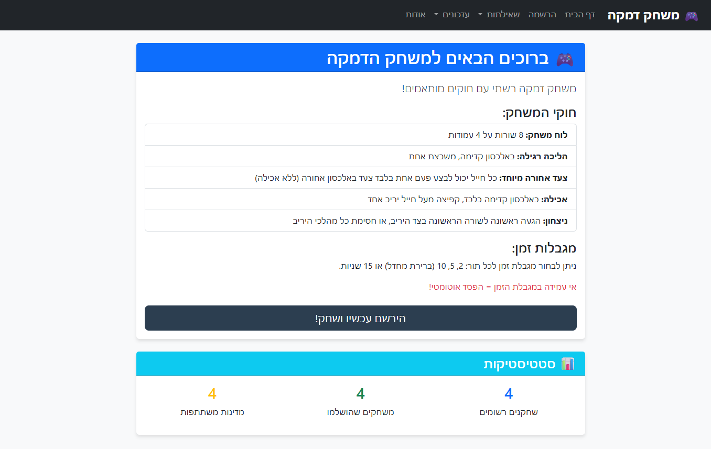
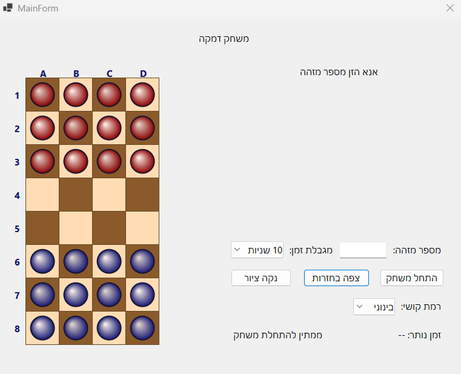
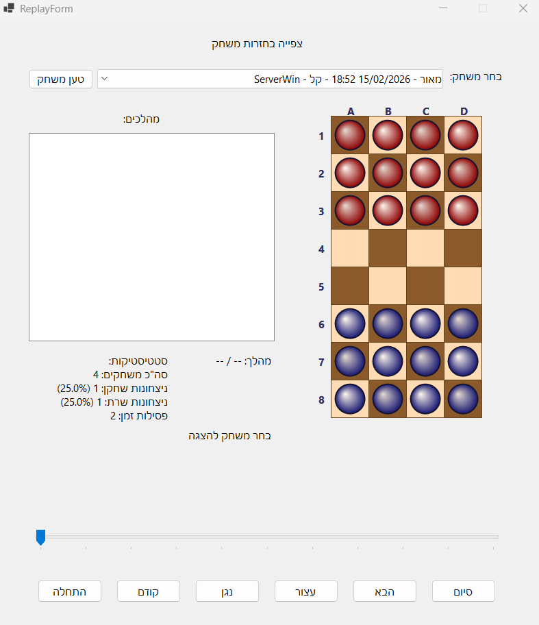

# 🎮 Checkers Game

## 📋 Table of Contents
- [Overview](#-overview)
- [System Requirements](#-system-requirements)
- [Installation & Setup](#-installation--setup)
- [Running the Project](#️-running-the-project)
- [Project Structure](#-project-structure)
- [Game Rules](#-game-rules)
- [System Features](#-system-features)
- [Difficulty Levels](#️-difficulty-levels)
- [Multi-Player Mode](#-multi-player-mode)
- [Database Queries](#-database-queries)
- [API Endpoints](#-api-endpoints)
- [Screenshots](#-screenshots)
- [Known Issues](#️-known-issues)
- [Technologies Used](#️-technologies-used)

---

## 🎯 Overview

A complete Checkers game project consisting of:
- **ASP.NET Core Server** - Game management, player handling, and AI logic
- **WinForms Client** - Graphical user interface for gameplay
- **SQL Server Database** - Persistent storage for players, games, and moves

The game supports single-player mode against the server (AI) as well as multi-player mode where multiple players take turns against the server.

---

## 💻 System Requirements

### Required Software
| Component | Minimum Version |
|-----------|-----------------|
| Visual Studio | 2022 or later |
| .NET SDK | 8.0 |
| SQL Server LocalDB | 2019 or later |
| Windows | 10/11 |

### NuGet Packages (Auto-installed)
**Server:**
- Microsoft.EntityFrameworkCore.SqlServer
- Microsoft.EntityFrameworkCore.Design

**Client:**
- Newtonsoft.Json
- Microsoft.EntityFrameworkCore.SqlServer

---

## 🔧 Installation & Setup

### Step 1: Clone/Open the Project
```bash
# Open projects in Visual Studio
# Server: CheckersProjectOld/Server/CheckersServer.sln
# Client: CheckersProjectOld/Client/CheckersClient.sln
```

### Step 2: Database Setup

#### Option A: Automatic Creation (Recommended)
The database is automatically created on first server startup via Entity Framework migrations.

#### Option B: Manual Creation
Run the following scripts in SQL Server Management Studio:
```sql
-- 1. Create the database
CREATE DATABASE CheckersGameDb;
GO
USE CheckersGameDb;
GO

-- 2. Run scripts from Database folder in order:
-- 01_Countries.sql
-- 02_Players.sql
-- 03_GameSessions.sql
-- 04_GameMoves.sql
-- 05_SoldierBackwardUsed.sql
```

### Step 3: Multi-Player Migration
If you have an existing database and want multi-player support:
```sql
-- Run the migration script:
Database/Migration_PopulateGameParticipants.sql
```

### Step 4: Configure Connection String
Verify the connection string in `appsettings.json`:
```json
{
  "ConnectionStrings": {
    "DefaultConnection": "Server=(localdb)\\MSSQLLocalDB;Database=CheckersGameDb;Trusted_Connection=true;MultipleActiveResultSets=true"
  }
}
```

---

## ▶️ Running the Project

### Starting the Server
1. Open `CheckersServer.sln` in Visual Studio
2. Press `F5` or `Ctrl+F5`
3. Server starts at: `https://localhost:7246`

### Starting the Client
1. Open `CheckersClient.sln` in Visual Studio
2. Press `F5` or `Ctrl+F5`
3. Enter a registered player's identification number
4. Select difficulty level and time limit
5. Click "Start Game"

### Correct Startup Order
```
1. Start the server (CheckersServer)
2. Start the client (CheckersClient)
3. Register a new player at https://localhost:7246/Register
4. Enter the identification number in the client and start playing
```

---

## 📁 Project Structure

```
CheckersProjectOld/
│
├── Client/                          # WinForms Client Application
│   ├── MainForm.cs                  # Main form - game board
│   ├── MainForm.Designer.cs         # Main form designer
│   ├── ReplayForm.cs                # Game replay viewer
│   ├── ReplayForm.Designer.cs       # Replay form designer
│   ├── LocalGameDatabase.cs         # Local database for game storage
│   ├── Program.cs                   # Entry point
│   └── CheckersClient.csproj        # Project file
│
├── Server/                          # ASP.NET Core Server
│   ├── Controllers/
│   │   └── GameController.cs        # Game API controller
│   │
│   ├── Data/
│   │   └── CheckersDbContext.cs     # Entity Framework DbContext
│   │
│   ├── Models/
│   │   └── Models.cs                # Entity models and DTOs
│   │
│   ├── Pages/                       # Razor Pages
│   │   ├── Index.cshtml             # Home page
│   │   ├── Register.cshtml          # Player registration
│   │   ├── About.cshtml             # About page
│   │   │
│   │   ├── Queries/                 # Data query pages
│   │   │   ├── AllGames.cshtml      # All games listing
│   │   │   ├── AllPlayers.cshtml    # All players listing
│   │   │   ├── GamesCount.cshtml    # Games per player count
│   │   │   ├── PlayerGames.cshtml   # Specific player's games
│   │   │   ├── PlayersLastGame.cshtml # Last game per player
│   │   │   ├── FirstFromCountry.cshtml # First player from each country
│   │   │   ├── GroupByCountry.cshtml # Players grouped by country
│   │   │   ├── GroupByGamesCount.cshtml # Players grouped by game count
│   │   │   └── TopCountries.cshtml  # Top 2 countries by games
│   │   │
│   │   └── Update/                  # Data modification pages
│   │       ├── UpdatePlayer.cshtml  # Update player info
│   │       ├── DeletePlayer.cshtml  # Delete player
│   │       └── DeleteGame.cshtml    # Delete game
│   │
│   ├── wwwroot/                     # Static files (CSS, JS, images)
│   ├── Program.cs                   # Entry point & configuration
│   └── appsettings.json             # Application settings
│
├── Database/                        # SQL Scripts
│   ├── dbo.Countries.sql
│   ├── dbo.GameParticipants.sql
│   ├── dbo.Games.sql
│   ├── dbo.LocalGames.sql
│   ├── dbo.LocalMoves.sql
│   ├── dbo.Moves.sql
│   ├── dbo.Players.sql
│   └── dbo.SoldierBackwardsUsed.sql
│
└── README_EN.md                     # documentation (this file)
```

---

## 🎲 Game Rules

### Game Board
- Board size: **8×4** squares (8 rows, 4 columns)
- Player (Blue) starts on rows 5-7 (12 pieces)
- Server (Red) starts on rows 0-2 (12 pieces)

### Movement
- Pieces move **diagonally only**
- Regular move: One square forward diagonally
- **Backward move**: Each piece can make **only ONE backward move** during the entire game

### Capturing
- Capture by jumping over an opponent's piece
- Capture is **mandatory** when available
- Captures can be made forward or backward

### Winning Conditions
A player wins when:
- All opponent pieces are captured, **OR**
- The opponent has no legal moves

### Time Limit
- Each move has a configurable time limit
- Running out of time results in a loss

---

## ✨ System Features

### Client (WinForms)
| Feature | Description |
|---------|-------------|
| 🎨 Graphical Interface | Colorful game board with gradient pieces |
| ⏱️ Turn Timer | Visual countdown for each move |
| 🔄 Smooth Animations | Animated piece movement |
| ✏️ Free Drawing | Draw on the board using right mouse button |
| 📼 Game Replay | Watch previously played games |
| 📊 Statistics | Win/loss tracking and percentages |
| 🎯 Difficulty Selection | Three AI difficulty levels |
| 💡 Move Highlighting | Visual feedback for selected pieces |

### Server (ASP.NET Core)
| Feature | Description |
|---------|-------------|
| 📝 Registration | New player registration with validation |
| 🎮 Game Management | Create, update, delete games |
| 🤖 AI Engine | Intelligent game opponent |
| 📊 LINQ Queries | Different data queries |
| 👥 Multi-Player | Support for multiple players per game |
| 🌐 REST API | Full API for client communication |
| 🔒 Data Validation | Input validation on all forms |

---

## 🎚️ Difficulty Levels

### Easy (Level 1)
```
Strategy: Completely random move selection
Behavior: The server randomly selects from all available legal moves
Best for: Beginners learning the game
```

### Medium (Level 2)
```
Strategy: Priority-based decision making
Priority Order:
1. Capture moves (if available)
2. Winning moves
3. Safe forward moves
4. Any safe move
5. Random move (fallback)

Best for: Casual players
```

### Hard (Level 3)
```
Algorithm: Minimax with Alpha-Beta Pruning
Search Depth: 3 levels
Evaluation Function:
- Material advantage (piece count difference)
- Positional advantage (board control)
- Center control bonus
- Forward progress bonus

Best for: Experienced players seeking a challenge
```

---

## 👥 Multi-Player Mode

### How It Works
In multi-player mode, **multiple players** (2-10) participate in the same game session, taking turns against the server.

### Turn Order
```
Player A → Server → Player B → Server → Player C → Server → ...
```

### Setting Up Multi-Player

#### Step 1: Register Players
1. Navigate to: `https://localhost:7246/Register`
2. Select number of players (2-10)
3. Fill in details for each player
4. Click "Register"

#### Step 2: Start the Game
1. Open the client application
2. Enter the identification number of **any** registered player
3. The server automatically connects all players registered together

### Database Schema

```sql
-- GameParticipants table (Many-to-Many relationship)
CREATE TABLE GameParticipants (
    GameId INT NOT NULL,
    PlayerId INT NOT NULL,
    TurnOrder INT NOT NULL,  -- Turn order (1, 2, 3...)
    PRIMARY KEY (GameId, PlayerId),
    FOREIGN KEY (GameId) REFERENCES GameSessions(GameId) ON DELETE CASCADE,
    FOREIGN KEY (PlayerId) REFERENCES Players(PlayerId) ON DELETE NO ACTION
);
```

### Multi-Player Display
- All player names are shown in queries and game listings
- Format: "Player1, Player2, Player3"
- Replay form shows all participants

---

## 📊 Database Queries

The system implements **LINQ queries**:

| # | Query | Description | LINQ Features Used |
|---|-------|-------------|-------------------|
| 22 | All Players | Players who have played, with full details | `Where`, `Include`, `OrderBy` |
| 23 | Last Game | Each player with their last game date | `Max`, `Select`, `OrderByDescending` |
| 24 | All Games | All games with complete details | `Include`, `Select`, `OrderByDescending` |
| 25 | First from Country | First player to play from each country | `GroupBy`, `Min`, `First` |
| 26 | Player Games | All games for a selected player (ComboBox) | `Where`, `Include`, `ToList` |
| 27 | Games Count | Game count per player (name + count only) | `Select`, `Count`, `OrderByDescending` |
| 28 | Group by Count | Players grouped by their game count | `GroupBy`, `Select`, `OrderByDescending` |
| 29 | Group by Country | Players grouped by country | `Include`, `GroupBy`, `Where` |
| 30 | Top Countries | Top 2 countries by total games | `SelectMany`, `Count`, `Take` |

### Query Implementation Notes
- All queries use **LINQ** (no raw SQL loops)
- Queries support multi-player games via `GameParticipants` table
- Client-side evaluation used where EF Core cannot translate complex expressions

---

## 🔌 API Endpoints

### Player Endpoints
```http
GET    /api/game/countries                       # Get list of countries
GET    /api/game/check-id/{id}                   # Check if ID is available
POST   /api/game/register                        # Register new player
GET    /api/game/player/{id}                     # Get player by ID
GET    /api/game/player/by-identification/{num}  # Get player by identification number
```

### Game Endpoints
```http
POST   /api/game/start                           # Start single-player game
POST   /api/game/start-multiplayer               # Start multi-player game
POST   /api/game/move                            # Make a move
GET    /api/game/participants/{gameId}           # Get game participants
```

### Request/Response Examples

#### Start Game Request
```json
POST /api/game/start
Content-Type: application/json

{
    "playerId": 1,
    "timeLimitSeconds": 10,
    "difficulty": 2
}
```

#### Start Game Response
```json
{
    "gameId": 100,
    "playerId": 1,
    "startTime": "2026-02-15T17:30:00",
    "result": "InProgress",
    "timeLimitSeconds": 10,
    "difficulty": 2
}
```

#### Make Move Request
```json
POST /api/game/move
Content-Type: application/json

{
    "gameId": 100,
    "fromRow": 5,
    "fromCol": 0,
    "toRow": 4,
    "toCol": 1
}
```

#### Make Move Response
```json
{
    "isValid": true,
    "errorMessage": null,
    "serverFromRow": 2,
    "serverFromCol": 1,
    "serverToRow": 3,
    "serverToCol": 0,
    "serverCapture": false,
    "gameResult": "Continue"
}
```

#### Game Result Values
| Value | Description |
|-------|-------------|
| `Continue` | Game continues |
| `PlayerWin` | Player has won |
| `ServerWin` | Server has won |

---

## 📸 Screenshots

### Game Site


### Game Form 


### Replay Games Form


---

## ⚠️ Known Issues

### 1. SSL Certificate Error in Client
**Issue:** `The SSL connection could not be established`

**Solution:** Already handled in code - SSL validation is bypassed in development:
```csharp
var handler = new HttpClientHandler {
    ServerCertificateCustomValidationCallback = (_, _, _, _) => true
};
```

### 2. Database Not Found
**Issue:** `Cannot open database "CheckersGameDb"`

**Solutions:**
1. Ensure SQL Server LocalDB is installed
2. Run: `sqllocaldb start MSSQLLocalDB`
3. Restart the server

### 3. Migration Required Error
**Issue:** `Invalid column name 'TotalPlayers'` or `Invalid column name 'AllPlayerNames'`

**Solution:** Run the migration script:
```sql
USE CheckersGameDb;
GO
-- Execute: Database/Migration_PopulateGameParticipants.sql
```

### 4. Port Already in Use
**Issue:** `Failed to bind to address https://localhost:7246`

**Solution:**
1. Check for other instances: `netstat -ano | findstr 7246`
2. Kill the process or change the port in `launchSettings.json`

### 5. LocalDB Connection Issues
**Issue:** `A network-related or instance-specific error`

**Solutions:**
1. Open command prompt as Administrator
2. Run: `sqllocaldb stop MSSQLLocalDB`
3. Run: `sqllocaldb delete MSSQLLocalDB`
4. Run: `sqllocaldb create MSSQLLocalDB`
5. Run: `sqllocaldb start MSSQLLocalDB`

---

## 🛠️ Technologies Used

### Backend
- **ASP.NET Core 8.0** - Web framework
- **Entity Framework Core 8.0** - ORM
- **Razor Pages** - Server-side rendering
- **SQL Server LocalDB** - Database

### Frontend
- **Windows Forms (.NET 8)** - Desktop UI
- **GDI+** - Graphics rendering
- **Newtonsoft.Json** - JSON serialization

### Architecture
- **MVC Pattern** - Server structure
- **Repository Pattern** - Data access
- **REST API** - Client-server communication
- **Code-First** - Database approach

---

## 📝 Project Requirements Compliance

This project fulfills the following requirements:

| Requirement | Implementation |
|-------------|----------------|
| ✅ Client-Server Architecture | WinForms client + ASP.NET Core server |
| ✅ SQL Database | SQL Server with Entity Framework |
| ✅ Player Registration | Web form with validation |
| ✅ Game Logic | Complete checkers rules implementation |
| ✅ AI Opponent | Three difficulty levels |
| ✅ Move Validation | Server-side validation |
| ✅ Time Limit | Configurable turn timer |
| ✅ Backward Move Restriction | One backward move per piece |
| ✅ Game Replay | Local storage with playback |
| ✅ LINQ Queries | required queries implemented |
| ✅ Multi-Player Support | 2-10 players per game |
| ✅ Free Drawing | Right-click drawing on board |

---

## 👨‍💻 Development Notes

### Adding New Features
1. Models go in `Server/Models/Models.cs`
2. Database changes require migration
3. API endpoints in `GameController.cs`
4. UI changes in respective form files

### Testing
- Test server independently via Swagger/Postman
- Test client with mock data if needed
- Verify database state after operations

### Debugging Tips
- Check `Output` window for EF Core SQL queries
- Use browser DevTools for API debugging
- Client exceptions show in Visual Studio

---

## 📜 License

This project was created as a final project for a Software Engineering course.

---

Made with ❤️ by Maor Mordo
